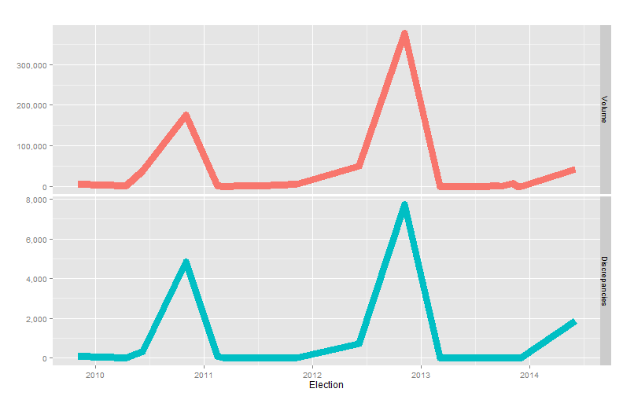
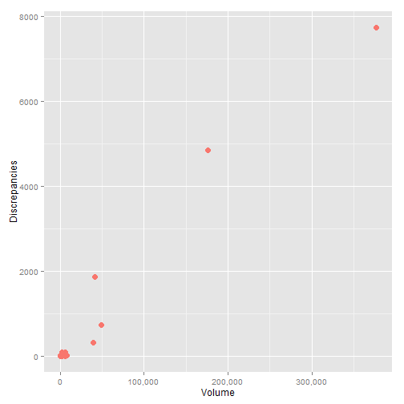

<!-- Limit image width and height -->

<!-- Center image on slide -->

# Historical ballot accountability figures
  
  

|   &nbsp; |  Election  |  Volume  |  Diff  |    %    |
|---------:|:----------:|:--------:|:------:|:-------:|
|    **1** | 2009-11-03 |   6536   |   89   |  1.362  |
|    **2** | 2010-04-13 |   1233   |   1    | 0.0811  |
|    **3** | 2010-06-08 |  39097   |  318   | 0.8134  |
|    **4** | 2010-11-02 |  175697  |  4836  |  2.752  |
|    **5** | 2011-02-15 |   1810   |   88   |  4.862  |
|    **6** | 2011-03-08 |   287    |   2    | 0.6969  |
|    **8** | 2011-07-12 |   2064   |   0    |    0    |
|    **9** | 2011-11-08 |   6510   |   1    | 0.01536 |
|   **10** | 2012-06-05 |  49243   |  726   |  1.474  |
|   **11** | 2012-11-06 |  377046  |  7722  |  2.048  |
|   **12** | 2013-03-05 |   431    |   1    |  0.232  |
|   **13** | 2013-03-12 |   193    |   0    |    0    |
|   **18** | 2013-11-05 |   7910   |   2    | 0.02528 |
|   **21** | 2014-06-03 |  41622   |  1851  |  4.447  |

---

# Volume and Discrepancies Over Time

---

# As we get more ballots, the number of discrepancies increases

* The only occasions when we had zero discrepancies were times when we received under 2,000 provisionals.

---

# Work Cell Pilot

---

# Work Cell Design

* Signature verification, open envelopes, enhance/remake ballots, process write-ins, and send to tally 
* 10% of staff participated in the pilot 
* 2 trays delivered to the work cell per day
* The work cell only counted ballots 2 times: entrance and exit.

---

# Today's Accountability

* Work Cell volume: 17,600 (15%)  
* Work Cell discrepancies: 0 

* Normal Process volume: 104,000 (85%)  
* Normal Process discrepancies: 128

* November 2010 Gubernatorial Election (last comparable election)
* If we had 15% of that volume, we would have had 725 discrepancies 

| &nbsp;  |  Election  |  Volume  |  Diff  |
|:-------:|:----------:|:--------:|:------:|
|  **4**  | 11/2/2010  | 175,697  | 4,836  |

---

# Productivity Ratios

---

# Benefits/Observations

* Eliminated 50 hours of counting (15 min per tray * 200 trays) each time we count
* Faster training because supervisor has time now
* Enabled cross-training of Canvass operations
* Write-ins - being in the same room eliminates a count
* Ballot Duplication - faster communication without handoffs

---

# Recommendations

* Don't slow the flow to work cell
* Single-piece flow all the way (Signature Verification through Canvass)
* Ergonomics
* Add one additional ballot duplication PC and scanner 
* Hybrid for large elections (UDEL)
